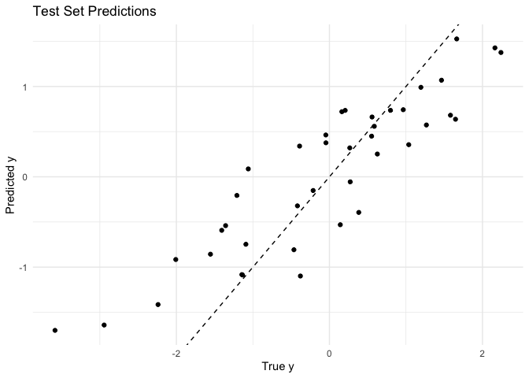
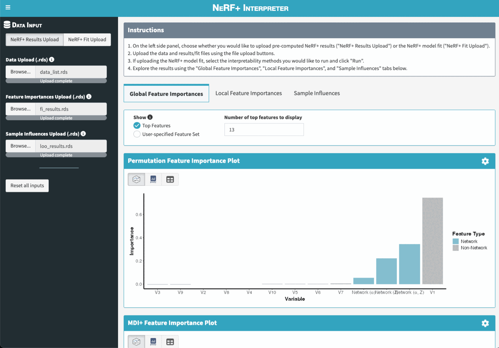

<!-- README.md is generated from README.Rmd. Please edit that file -->

# Network-assisted Random Forest+ (NeRF+)

[Network-assisted Random Forest+]() (NeRF+) is a flexible and
interpretable machine learning model for incorporating network data
alongside node-level covariate information. Briefly, NeRF+ extends a
generalization of random forests (RF) called RF+ [(Agarwal et
al. 2025)](https://arxiv.org/pdf/2307.01932) to the network-assisted
regression setting by incorporating both a network cohesion penalty and
network embeddings as additional covariates. Using this approach, NeRF+
inherits both the flexibility and interpretability of RFs while allowing
researchers to easily incorporate network information in their model to
further improve predictive performance.

For more details, check out [Tang, T. M., Levina, E., Zhu, J.
“Interpretable Network-assisted Random Forest+.” (2025).]()

## Organization

This repository contains:

1.  An R package `nerfplus` to run NeRF+ on your own data (see
    [nerfplus/](nerfplus/))
2.  All code necessary to reproduce the analysis and figures in [Tang et
    al. (2025)]() (see [nerfplus-manuscript/](nerfplus-manuscript/))

## Installation of the R package

You can install the `nerfplus` R package via:

``` r
# install.packages("remotes")
remotes::install_github("tiffanymtang/nerfplus", subdir = "nerfplus")
# or uncomment below to install with suggested dependencies; necessary to launch Shiny App
# remotes::install_github("tiffanymtang/nerfplus", subdir = "nerfplus", dependencies = "Suggests")
```

## Example Usage

To demonstrate how to use nerfplus, we will make use of an example
dataset provided in the package:

``` r
library(nerfplus)
set.seed(331)

# load example data
data(example_data)
str(example_data)
#> List of 6
#>  $ x     : num [1:80, 1:10] -0.0676 -1.0671 0.4536 1.479 0.0363 ...
#>  $ xtest : num [1:40, 1:10] -1.4549 -0.1724 -0.6287 0.0805 -0.3741 ...
#>  $ y     : num [1:80] -0.842 -2.413 -0.131 0.313 -0.714 ...
#>  $ ytest : num [1:40] -2.24 -1.36 -1.55 -1.21 -1.41 ...
#>  $ A     : num [1:80, 1:80] 0 1 1 1 0 1 0 1 1 1 ...
#>  $ A_full: num [1:120, 1:120] 0 1 1 1 0 1 0 1 1 1 ...
```

This example data contains:

- `x`: training covariate data
- `xtest`: test covariate data
- `y`: training response data
- `ytest`: test response data
- `A`: training adjacency matrix
- `A_full`: full adjacency matrix (training and test samples combined)

Note that the samples in `A_full` must be aligned with the rows of `x`
and `xtest`, in that order. If not, you can provide a vector of node IDs
to indicate the alignment (`nodeids` for the training samples and
`nodeids_test` for the test samples’ see
`? nerfplus::interpret_nerfplus` for details).

Using this example dataset, we can first fit NeRF+ with pre-specified
hyperparameters via:

``` r
lambda_netcoh <- 1
lambda_embed <- 0.1
lambda_raw <- 2
lambda_stump <- 3
fit <- nerfplus(
  x = example_data$x, y = example_data$y, A = example_data$A,
  lambda_netcoh = lambda_netcoh,
  lambda_embed = lambda_embed,
  lambda_raw = lambda_raw,
  lambda_stump = lambda_stump,
  family = "linear", embedding = "laplacian"
)
```

If we want to tune the hyperparameters, we can instead use
`nerfplus_cv()`.

``` r
lambdas_netcoh <- exp(seq(log(100), log(0.01), length.out = 5))
lambdas_embed <- exp(seq(log(100), log(0.01), length.out = 5))
lambdas_raw <- exp(seq(log(100), log(0.01), length.out = 5))
lambdas_stump <- exp(seq(log(100), log(0.01), length.out = 5))
cv_fit <- nerfplus_cv(
  x = example_data$x, y = example_data$y, A = example_data$A,
  lambdas_netcoh = lambdas_netcoh,
  lambdas_embed = lambdas_embed,
  lambdas_raw = lambdas_raw,
  lambdas_stump = lambdas_stump,
  family = "linear", embedding = "laplacian"
)
```

Let’s quickly make predictions on the test set using our fitted (tuned)
model and check its test prediction performance.

``` r
yhat <- predict(
  cv_fit, x = example_data$xtest, A_full = example_data$A_full
)
cat(sprintf("Test MSE: %.3f", mean((yhat - example_data$ytest)^2)))
#> Test MSE: 0.482
```

``` r
data.frame(ytest = example_data$ytest, yhat = yhat) |>
  ggplot2::ggplot(ggplot2::aes(x = ytest, y = yhat)) +
  ggplot2::geom_point() +
  ggplot2::geom_abline(
    slope = 1, intercept = 0, color = "black", linetype = "dashed"
  ) +
  ggplot2::labs(
    title = "Test Set Predictions",
    x = "True y",
    y = "Predicted y"
  ) +
  ggplot2::theme_minimal()
```

<!-- -->

To next interpret our fitted NeRF+ model, we can report:

- the permutation and MDI+ global feature importances
- the local feature importances
- the leave-one-out (LOO) sample influence measures

``` r
interpret_results <- interpret_nerfplus(
  cv_fit,
  x = example_data$x, y = example_data$y, A = example_data$A,
  xtest = example_data$xtest, ytest = example_data$ytest, 
  A_full = example_data$A_full,
  methods = c("permute", "mdi+", "local", "loo"), 
  # save = TRUE,
  B = 25  # B = number of permutations
)
```

Or if we want to compute each of these interpretability measures
separately, we can do so via:

``` r
# permutation global feature importance
perm_globalfi <- get_feature_importances(
  cv_fit, 
  x = example_data$xtest, y = example_data$ytest, A_full = example_data$A_full,
  method = "permute", B = 25  # B = number of permutations
)

# MDI+ global feature importance
mdiplus_globalfi <- get_feature_importances(
  cv_fit, 
  x = example_data$xtest, y = example_data$ytest, A_full = example_data$A_full,
  method = "mdi+"
)

# local feature importance
localfi <- get_feature_importances(
  cv_fit, 
  x = example_data$xtest, y = example_data$ytest, A_full = example_data$A_full,
  method = "local"
)

# leave-one-out sample influence
loo_out <- get_loo(
  cv_fit, 
  x = example_data$x, y = example_data$y, A = example_data$A,
  xtest = example_data$xtest, ytest = example_data$ytest, 
  A_full = example_data$A_full
)
```

## NeRF+ Interpreter Shiny App

To further ease the interpretation of NeRF+ models, we also created a
Shiny App that allows users to visualize and explore the feature
importance and sample influence results interactively.



There are two main ways to launch the app. Note that both options rely
on the suggested dependencies being installed. If you did not install
the package with suggested dependencies, you can do so by running
`remotes::install_github("tiffanymtang/nerfplus", subdir = "nerfplus", dependencies = "Suggests")`.

**Option 1: Launch the app directly from R without any arguments.**

The Shiny App can be launched directly from R via the `run_app()`
function:

``` r
run_app()
```

After launching the app, users can upload their own data and their
fitted NeRF+ model (or pre-computed interpretability results) in the app
to then explore the results.

*Note:* If users want to upload their pre-computed interpretability
results (as opposed to having the Shiny App compute them), they can do
so by uploading the `.rds` files created by the
`interpret_nerfplus(save = TRUE)` function.

**Option 2: Launch the app directly from R with pre-computed
interpretability results.**

Alternatively, users can use the `interpret_nerfplus()` function to
compute the interpretability results first, and then launch the Shiny
App with these results as arguments to `run_app()`. For example:

``` r
interpret_results <- interpret_nerfplus(
  cv_fit,
  x = example_data$x, y = example_data$y, A = example_data$A,
  xtest = example_data$xtest, ytest = example_data$ytest, 
  A_full = example_data$A_full,
  methods = c("permute", "mdi+", "local", "loo"), B = 25
)
run_app(
  data_list = interpret_results$data_list,
  object = interpret_results$object,
  fi_results = interpret_results$fi_results,
  loo_results = interpret_results$loo_results
)
```

## Citation

<!-- You'll still need to render `README.Rmd` regularly, to keep `README.md` up-to-date. `devtools::build_readme()` is handy for this. -->
