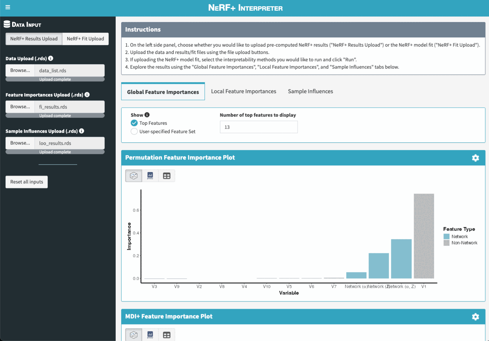

<!-- README.md is generated from README.Rmd. Please edit that file -->

```{r, include = FALSE}
knitr::opts_chunk$set(
  collapse = TRUE,
  comment = "#>",
  fig.path = "man/figures/README-",
  out.width = "100%"
)
```

# nerfplus

<!-- badges: start -->
<!-- badges: end -->

nerfplus is an R package for fitting and interpreting **Ne**twork-assisted **R**andom **F**orest+ (NeRF+) models, as introduced in [Tang, Levina, and Zhu (2025+)](). At a high-level, NeRF+ provides a flexible and interpretable framework to incorporate network information alongside node-level covariate information in a generalized random forest framework. In practice, NeRF+ often exhibits highly-competitive predictive performance and importantly, can also be easily interpreted using feature importance and sample influence measures that are implemented in this package's interpretability toolkit.

## Installation

You can install the development version of nerfplus from [GitHub](https://github.com/) with:

``` r
# install.packages("remotes")
remotes::install_github("tiffanymtang/nerfplus", subdir = "nerfplus")
# or uncomment below to install with suggested dependencies; necessary to launch Shiny App
# remotes::install_github("tiffanymtang/nerfplus", subdir = "nerfplus", dependencies = "Suggests")
```

## Example Usage

To demonstrate how to use nerfplus, we will make use of an example dataset provided in the package:

```{r example}
library(nerfplus)
set.seed(331)

# load example data
data(example_data)
str(example_data)
```

This example data contains:

- `x`: training covariate data
- `xtest`: test covariate data
- `y`: training response data
- `ytest`: test response data
- `A`: training adjacency matrix
- `A_full`: full adjacency matrix (training and test samples combined)

Note that the samples in `A_full` must be aligned with the rows of `x` and `xtest`, in that order. If not, you can provide a vector of node IDs to indicate the alignment (`nodeids` for the training samples and `nodeids_test` for the test samples' see `? nerfplus::interpret_nerfplus` for details).

Using this example dataset, we can first fit NeRF+ with pre-specified hyperparameters via:

```{r fit}
lambda_netcoh <- 1
lambda_embed <- 0.1
lambda_raw <- 2
lambda_stump <- 3
fit <- nerfplus(
  x = example_data$x, y = example_data$y, A = example_data$A,
  lambda_netcoh = lambda_netcoh,
  lambda_embed = lambda_embed,
  lambda_raw = lambda_raw,
  lambda_stump = lambda_stump,
  family = "linear", embedding = "laplacian"
)
```

If we want to tune the hyperparameters, we can instead use `nerfplus_cv()`.

```{r cv_fit}
lambdas_netcoh <- exp(seq(log(100), log(0.01), length.out = 5))
lambdas_embed <- exp(seq(log(100), log(0.01), length.out = 5))
lambdas_raw <- exp(seq(log(100), log(0.01), length.out = 5))
lambdas_stump <- exp(seq(log(100), log(0.01), length.out = 5))
cv_fit <- nerfplus_cv(
  x = example_data$x, y = example_data$y, A = example_data$A,
  lambdas_netcoh = lambdas_netcoh,
  lambdas_embed = lambdas_embed,
  lambdas_raw = lambdas_raw,
  lambdas_stump = lambdas_stump,
  family = "linear", embedding = "laplacian"
)
```

Let's quickly make predictions on the test set using our fitted (tuned) model and check its test prediction performance.

```{r predict}
yhat <- predict(
  cv_fit, x = example_data$xtest, A_full = example_data$A_full
)
cat(sprintf("Test MSE: %.3f", mean((yhat - example_data$ytest)^2)))
```

```{r predict-plot}
data.frame(ytest = example_data$ytest, yhat = yhat) |>
  ggplot2::ggplot(ggplot2::aes(x = ytest, y = yhat)) +
  ggplot2::geom_point() +
  ggplot2::geom_abline(
    slope = 1, intercept = 0, color = "black", linetype = "dashed"
  ) +
  ggplot2::labs(
    title = "Test Set Predictions",
    x = "True y",
    y = "Predicted y"
  ) +
  ggplot2::theme_minimal()
```

To next interpret our fitted NeRF+ model, we can report:

- the permutation and MDI+ global feature importances
- the local feature importances
- the leave-one-out (LOO) sample influence measures

```{r interpret-wrapper}
interpret_results <- interpret_nerfplus(
  cv_fit,
  x = example_data$x, y = example_data$y, A = example_data$A,
  xtest = example_data$xtest, ytest = example_data$ytest, 
  A_full = example_data$A_full,
  methods = c("permute", "mdi+", "local", "loo"), 
  # save = TRUE,
  B = 25  # B = number of permutations
)
```

Or if we want to compute each of these interpretability measures separately, we can do so via:

```{r interpret}
# permutation global feature importance
perm_globalfi <- get_feature_importances(
  cv_fit, 
  x = example_data$xtest, y = example_data$ytest, A_full = example_data$A_full,
  method = "permute", B = 25  # B = number of permutations
)

# MDI+ global feature importance
mdiplus_globalfi <- get_feature_importances(
  cv_fit, 
  x = example_data$xtest, y = example_data$ytest, A_full = example_data$A_full,
  method = "mdi+"
)

# local feature importance
localfi <- get_feature_importances(
  cv_fit, 
  x = example_data$xtest, y = example_data$ytest, A_full = example_data$A_full,
  method = "local"
)

# leave-one-out sample influence
loo_out <- get_loo(
  cv_fit, 
  x = example_data$x, y = example_data$y, A = example_data$A,
  xtest = example_data$xtest, ytest = example_data$ytest, 
  A_full = example_data$A_full
)
```


## NeRF+ Interpreter Shiny App

To further ease the interpretation of NeRF+ models, we also created a Shiny App that allows users to visualize and explore the feature importance and sample influence results interactively. 



There are two main ways to launch the app. Note that both options rely on the suggested dependencies being installed. If you did not install the package with suggested dependencies, you can do so by running `remotes::install_github("tiffanymtang/nerfplus", subdir = "nerfplus", dependencies = "Suggests")`.

**Option 1: Launch the app directly from R without any arguments.**

The Shiny App can be launched directly from R via the `run_app()` function:

```{r app, eval = FALSE}
run_app()
```

After launching the app, users can upload their own data and their fitted NeRF+ model (or pre-computed interpretability results) in the app to then explore the results. 

*Note:* If users want to upload their pre-computed interpretability results (as opposed to having the Shiny App compute them), they can do so by uploading the `.rds` files created by the `interpret_nerfplus(save = TRUE)` function.

**Option 2: Launch the app directly from R with pre-computed interpretability results.**

Alternatively, users can use the `interpret_nerfplus()` function to compute the interpretability results first, and then launch the Shiny App with these results as arguments to `run_app()`. For example:

```{r app-args, eval = FALSE}
interpret_results <- interpret_nerfplus(
  cv_fit,
  x = example_data$x, y = example_data$y, A = example_data$A,
  xtest = example_data$xtest, ytest = example_data$ytest, 
  A_full = example_data$A_full,
  methods = c("permute", "mdi+", "local", "loo"), B = 25
)
run_app(
  data_list = interpret_results$data_list,
  object = interpret_results$object,
  fi_results = interpret_results$fi_results,
  loo_results = interpret_results$loo_results
)
```

<!-- You'll still need to render `README.Rmd` regularly, to keep `README.md` up-to-date. `devtools::build_readme()` is handy for this. -->
